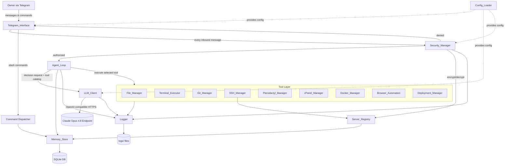
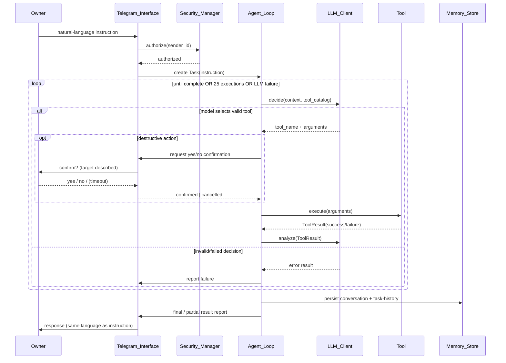

# Design Document

## Overview

The AI DevOps & Coding Agent is a single, long-lived Python 3.11+ process that runs continuously on an Ubuntu VPS (4 GB RAM, 2 vCPU). It is controlled exclusively by one Telegram user (the Owner) through a Telegram bot. Natural-language instructions (Indonesian or English) are forwarded to a Claude Opus 4.8 model exposed via an OpenAI-compatible endpoint. The model reasons about each instruction and drives an **agent loop** that selects and executes internal **tools** through the model's function/tool-calling interface, iterating until the task is complete or a 25-iteration safety limit is reached.

The design is organized into four cooperating layers:

1. **Interface layer** — `Telegram_Interface` receives messages, dispatches slash commands, and renders results.
2. **Control layer** — `Security_Manager` (access control + confirmation + credential crypto), `Agent_Loop` (orchestration), and `LLM_Client` (model reasoning + tool selection).
3. **Tool layer** — nine tool components (`File_Manager`, `Terminal_Executor`, `Git_Manager`, `SSH_Manager`, `Pterodactyl_Manager`, `cPanel_Manager`, `Docker_Manager`, `Browser_Automation`, `Deployment_Manager`).
4. **Persistence & observability layer** — `Memory_Store` (SQLite), `Server_Registry` (a logical view over SQLite), `Config_Loader` (Pydantic-validated env config), and `Logger` (file logging under `logs/`).

### Key Design Decisions

| Decision | Rationale |
|----------|-----------|
| Single async process built on `python-telegram-bot` v20+ (asyncio) | Requirement 2 mandates one long-lived process; asyncio keeps memory low (R2.5) and allows non-blocking I/O for many slow tools. |
| Blocking/CPU-heavy tools run in a bounded thread pool (`asyncio.to_thread`) | `paramiko`, `requests`, `subprocess`, `playwright` sync APIs are blocking; offloading them keeps the Telegram connection responsive without spawning unbounded threads (memory ceiling R2.5). |
| All tools return a uniform `ToolResult` envelope (`success`, `data`, `error`) | Requirements consistently demand "a result indicating success or failure" (R8.9, R10.6, R15.5, etc.); a single contract simplifies the agent loop and the model's result analysis. |
| Tool catalog expressed as OpenAI function-calling JSON schemas | Requirement 6 requires sending the tool catalog to the model and parsing the selected tool + arguments (R6.4–R6.6). |
| Credentials encrypted at rest with Fernet (symmetric AES) | Requirements 11.4, 21.1, 21.2 require encryption before persistence and decryption only in memory. Fernet provides authenticated symmetric encryption with a key derived from an environment-supplied secret. |
| Destructive actions gated behind explicit Telegram confirmation | Requirement 21.3–21.7, 21.11 require a yes/no confirmation flow with timeout and re-prompts. |
| SQLite via the standard-library `sqlite3` module | Requirement 19.1 and 22.5 mandate SQLite; no external DB server fits the constrained VPS. |
| Pydantic config object loaded once at startup | Requirements 1.5 and 22.5 mandate Pydantic-validated configuration. |

### Technology Stack (Requirement 22.5)

- **Language:** Python 3.11+ (startup guard halts on earlier runtimes — R22.9).
- **LLM:** OpenAI SDK pointed at `BASE_URL` with `API_KEY`/`MODEL`.
- **Telegram:** `python-telegram-bot` (v20+, asyncio).
- **SSH/SFTP:** `paramiko`.
- **HTTP APIs (Pterodactyl, cPanel):** `requests`.
- **Browser:** `playwright`.
- **Persistence:** `sqlite3` (stdlib).
- **Config validation:** `pydantic`.
- **Docker:** the `docker` SDK (or `docker` CLI via `Terminal_Executor`) — see Docker_Manager.
- **Crypto:** `cryptography` (Fernet).

## Architecture

### Component Diagram



### Process & Concurrency Model

- A single OS process runs an asyncio event loop (Requirement 2.1). `python-telegram-bot`'s polling/updater keeps the Telegram connection alive and auto-reconnects; the Telegram_Interface additionally logs reconnection attempts with a timestamp and retries at intervals ≤ 10 s (R2.3).
- Inbound updates are handled by async handlers. Slash commands are dispatched directly; free-text instructions are routed (after the Security gate) into the Agent_Loop.
- Each task is processed sequentially per Owner instruction. Long-running, blocking tool calls (`subprocess`, `paramiko`, `requests`, `playwright` sync API) execute via `asyncio.to_thread`, bounded so concurrent blocking work cannot exhaust the 4 GB ceiling (R2.5).
- Unhandled errors during a single task are caught at the task boundary: the task is marked failed, logged, and the process keeps running (R2.4).

### Agent Loop Sequence



### Request Lifecycle (free-text instruction)

1. `Telegram_Interface` receives an update; `Security_Manager.authorize()` checks the sender against the configured Owner id (R3.1–R3.5).
2. If LLM features are disabled (missing `API_KEY`/`BASE_URL`/`MODEL`), the interface replies that the model is unavailable (R1.6, R6.8).
3. Otherwise `Agent_Loop` creates a `Task`, gathers recent context from `Memory_Store`, and enters the decision loop.
4. On task completion (or the 25-iteration limit), a result/partial-result report is sent and the conversation + task history are persisted.

## Components and Interfaces

Each tool method returns a `ToolResult` (see Data Models). Signatures below are conceptual contracts, not final Python.

### Config_Loader (`agent/config.py`)
- `load() -> Config`: reads `TELEGRAM_BOT_TOKEN`, `API_KEY`, `BASE_URL`, `MODEL` from `os.environ` only; treats absent/empty/whitespace-only as **not provided** (R1.1).
- Behavior:
  - Missing `TELEGRAM_BOT_TOKEN` → log the named missing variable and terminate startup before Telegram connects (R1.2).
  - Missing any of `API_KEY`/`BASE_URL`/`MODEL` → complete startup with `llm_enabled = False`, logging each missing variable by name (R1.3).
  - On success, exposes a validated Pydantic `Config` to Telegram_Interface and LLM_Client before message processing begins (R1.4, R1.5).
- `check_python_version()`: halts with an "unsupported Python version" message on runtimes earlier than 3.11 (R22.9).

### Telegram_Interface (`agent/telegram/`)
- Maintains the Telegram Bot API connection; logs reconnection attempts with timestamp and retries at ≤ 10 s intervals (R2.2, R2.3).
- Command dispatcher for `/start`, `/status`, `/memory`, `/clear`, `/projects`, `/servers`, `/deploy <id>`, `/logs`, and unknown commands (Requirement 4).
- `send_response(text)`: sends model responses verbatim, preserving the instruction language (R5.2).
- `request_confirmation(description, target) -> Decision`: presents a destructive-action prompt and collects a yes/no answer, with timeout and re-prompt handling delegated to Security_Manager's confirmation policy (R21.3–R21.6, R21.11).

### Security_Manager (`agent/` — security module)
- `authorize(sender_id) -> bool`: compares sender against the configured Owner id before forwarding to the Agent_Loop; rejects when Owner id is absent/empty (R3.1, R3.2, R3.4, R3.5). Logs rejected sender id + timestamp (R3.3).
- `encrypt(value) -> bytes` / `decrypt(token) -> str`: Fernet-based; encrypt before persistence (R11.4, R21.1), decrypt only in memory without persisting plaintext (R21.2). Encryption failure aborts the store (R21.9); decryption failure aborts the dependent operation (R21.10).
- `is_destructive(tool_name, args) -> bool`: classifies a selected action as a `Destructive_Action`.
- `interpret_confirmation(text) -> {YES, NO, AMBIGUOUS}`: parses the Owner's reply (R21.5).
- `authorize_server_target(server_name) -> bool`: blocks operations targeting servers absent from the Server_Registry (R21.8).

### LLM_Client (`agent/llm/`)
- `decide(task_context, tool_catalog) -> Decision`: sends context + catalog to the endpoint at `BASE_URL`, authenticated by `API_KEY`, with model `MODEL` (R6.1–R6.4).
  - Valid tool name + parseable args → return `(tool_name, arguments)` (R6.5).
  - Unknown tool or unparseable args → `INVALID_RESPONSE` error result, logged (R6.6).
  - Endpoint error or no response within 120 s → `FAILURE` result, logged; interface notifies the Owner (R6.7).
  - LLM disabled → `FEATURE_UNAVAILABLE` without a network call; interface notifies the Owner (R6.8).
- `analyze(tool_result) -> Decision`: returns whether the task is complete or the next step is needed (R7.3–R7.5).
- System prompt instructs the model to interpret Indonesian/English and reply in the same language (R5.3).

### Agent_Loop (`agent/main.py` orchestration)
- `run_task(instruction) -> TaskReport`: creates a `Task`, then loops: request decision → (confirm if destructive) → execute tool → analyze result.
- Stops when: the model reports complete (R7.5), 25 tool executions are reached (R7.6 — sends partial report R7.7), a tool raises (logged; failure result fed back to the model R7.8), or an LLM decision fails (stop + report R7.9).
- Persists the conversation record and the task-history record on completion (R19.2, R19.3).

### File_Manager (`agent/tools/files.py`)
- `read_file(path)`, `write_file(path, content)` (creates parent dirs, create/overwrite — R8.2), `append_file(path, content)` (preserves prior content — R8.3), `delete_file(path)`, `create_directory(path)` (idempotent success if exists — R8.5), `list_directory(path)` (direct entries; empty list when empty — R8.6), `search_files(term, dir)` (recursive, case-insensitive substring over name or contents — R8.7).
- Missing-path operations return an error identifying the path and leave the filesystem unchanged (R8.8).

### Terminal_Executor (`agent/tools/terminal.py`)
- `run_command(cmd)`: returns stdout, stderr (each capped at 1 MB), exit code; 300 s timeout terminates and reports partial output (R9.1, R9.6, R9.7).
- `get_processes()`, `check_disk_usage()` (MB used/available per filesystem), `check_memory_usage()` (MB), `check_cpu_usage()` (1 s sample, 0–100%) (R9.2–R9.5).

### Git_Manager (`agent/tools/git.py`)
- `clone_repo(url, dest)` (rejects non-empty existing dest — R10.9), `commit_changes(message)`, `push_changes(branch)`, `pull_changes(branch)` (merge conflict → error listing conflicting files, preserves local changes — R10.10), `create_branch(name)`.
- Each operation returns success/failure with Git's output (R10.6, R10.7); 300 s timeout for clone/push/pull (R10.8).

### SSH_Manager (`agent/tools/ssh.py`)
- Connects to a named Registered_Server via decrypted key or password within a 30 s connect timeout (R12.1–R12.3, R12.9).
- `run_remote_command`, `upload_file`, `download_file`, `sync_project` (recursive) (R12.4–R12.7).
- Errors: unregistered server (R12.8), connection failure (R12.9), auth failure (R12.10), transfer failure leaves destination unchanged (R12.11).

### Pterodactyl_Manager (`agent/tools/pterodactyl.py`)
- Authenticated by a stored API key (R13.1). `list_servers`, `upload_file`, `download_file`, `power(start|stop|restart)`, `console_output` (≤ 100 lines), `send_console_command` (R13.2–R13.7).
- Transfers retry up to 3 attempts, ≥ 2 s apart, 30 s per-attempt cap (R13.8). Auth failure and invalid reference abort without changing state (R13.9, R13.10).

### cPanel_Manager (`agent/tools/cpanel.py`)
- Authenticated by a stored API token (R14.1, R14.2). `upload_file` (≤ 100 MB), `download_file`, `create_database`, `create_subdomain`, `deploy_website` (R14.3–R14.7).
- Missing path rejects without modifying files (R14.8); 30 s per-operation timeout (R14.9); API errors returned, independent operations still succeed (R14.10).

### Docker_Manager (`agent/tools/docker.py`)
- `list_containers` (all states; empty list when none — R15.1, R15.8), `start|stop|restart` (≤ 10 s for stop/restart, returns resulting state — R15.2), `build_image(context, tag)` (R15.3, R15.7), `deploy_container(tag)` (returns container id — R15.4).
- Errors leave targets unchanged (R15.5); missing container/image returns not-found (R15.6); failed build creates/tags nothing (R15.7).

### Browser_Automation (`agent/tools/browser.py`)
- Playwright-controlled page: `browser_open(url)` (≤ 30 s nav), `browser_click(selector)`, `browser_type(selector, text ≤ 10000 chars)`, `browser_extract_text(selector)` (empty string when no text — R16.5), `browser_screenshot()` (returns image file path) (R16.1–R16.6).
- Any failure returns an error describing the failure, identifying the selector/URL, leaving page state unchanged (R16.7).

### Deployment_Manager (`agent/tools/deployment` orchestration)
- `build(project)` (≤ 600 s — R17.1, R17.7), `upload(target)` (R17.2), `deploy(target)` (R17.3, R17.8), `restart_service(target)` (≤ 120 s — R17.4, R17.9), `verify()` (successful response within ≤ 30 s — R17.5, R17.6).
- Failures leave existing active artifacts unchanged and trigger Owner notifications (R17.6–R17.9). Composes File_Manager, SSH_Manager, Terminal_Executor, and Browser_Automation.

### Memory_Store (`agent/memory/`, `agent/database/`)
- Persists conversations, servers, projects, task history in SQLite (R19.1).
- `save_conversation(message, response)` (R19.2), `save_task(description, tools, outcome)` (R19.3), `get_recent_context(n=20)` (most-recent-first, all when fewer — R19.4), `clear_conversations()` (retains servers/projects/tasks — R19.5, R4.4), `load_all()` on restart (R19.6).
- Failed persistence returns an error and preserves prior records without partial modification (R19.7).

### Server_Registry (logical component over Memory_Store)
- `register(server)`: validates name (1–100 chars), host (non-empty), port (1–65535 int), username (1–100 chars), and that at least one credential type is present (R11.1–R11.3, R11.7); rejects duplicate names (R11.8); encrypts the secret before persistence (R11.4).
- `list_servers()`: returns name/host/port/username, excluding secrets (R11.6, R4.6). Capacity ≥ 2 up to 100 (R11.5).

### Logger (`agent/` logging, output to `logs/`)
- Creates `logs/` if absent before first write (R20.6). Records command text + timestamp (R20.2), command result with exit code and output (capped at 1,000,000 chars + truncation indicator — R20.3, R9.1 alignment), tool name/arguments/timestamp (R20.4), one severity per entry from {info, warning, error} (R20.5).
- Write failure produces an error indication and does not terminate the Agent (R20.7).

## Data Models

### Tool-Calling Contract

The catalog sent to the model is a list of OpenAI-style function definitions:

```json
{
  "type": "function",
  "function": {
    "name": "write_file",
    "description": "Create or overwrite a file, creating missing parent directories.",
    "parameters": {
      "type": "object",
      "properties": {
        "path": {"type": "string"},
        "content": {"type": "string"}
      },
      "required": ["path", "content"]
    }
  }
}
```

`Decision` (LLM_Client → Agent_Loop):

```text
Decision {
  kind: SELECT_TOOL | TASK_COMPLETE | INVALID_RESPONSE | FAILURE | FEATURE_UNAVAILABLE
  tool_name: str | null        # present when kind == SELECT_TOOL
  arguments: dict | null       # present when kind == SELECT_TOOL
  message: str | null          # completion text or error explanation
}
```

`ToolResult` (every tool → Agent_Loop): uniform envelope.

```text
ToolResult {
  success: bool
  data: dict | null            # operation output on success
  error: str | null            # human-readable reason on failure
}
```

`Task` (in-memory, summarized into task-history on completion):

```text
Task {
  id: str
  instruction: str
  status: IN_PROGRESS | COMPLETE | FAILED | STOPPED_LIMIT
  executed_tools: list[str]
  iteration_count: int         # 0..25
  result_report: str
}
```

`Config` (Pydantic):

```text
Config {
  telegram_bot_token: str            # required; startup fails if not provided
  owner_id: int                      # required for access control
  api_key: str | None
  base_url: str | None
  model: str | None
  llm_enabled: bool                  # derived: True iff api_key, base_url, model all provided
}
```

### SQLite Schema (`agent/database/`)

```sql
-- Conversation history (cleared by /clear)
CREATE TABLE IF NOT EXISTS conversations (
    id          INTEGER PRIMARY KEY AUTOINCREMENT,
    message     TEXT NOT NULL,
    response    TEXT NOT NULL,
    created_at  TEXT NOT NULL          -- ISO-8601 timestamp
);

-- Registered remote servers (secrets stored encrypted)
CREATE TABLE IF NOT EXISTS servers (
    id              INTEGER PRIMARY KEY AUTOINCREMENT,
    name            TEXT NOT NULL UNIQUE,          -- 1..100 chars, unique (R11.8)
    host            TEXT NOT NULL,                 -- non-empty (R11.1)
    port            INTEGER NOT NULL,              -- 1..65535 (R11.1)
    username        TEXT NOT NULL,                 -- 1..100 chars (R11.1)
    auth_type       TEXT NOT NULL,                 -- 'key' | 'password' (R11.2, R11.3)
    secret_encrypted BLOB NOT NULL,                -- Fernet ciphertext (R11.4, R21.1)
    created_at      TEXT NOT NULL,
    CHECK (port BETWEEN 1 AND 65535),
    CHECK (length(name) BETWEEN 1 AND 100),
    CHECK (length(username) BETWEEN 1 AND 100),
    CHECK (auth_type IN ('key', 'password'))
);

-- Projects (referenced by /deploy and /projects)
CREATE TABLE IF NOT EXISTS projects (
    id          INTEGER PRIMARY KEY AUTOINCREMENT,
    identifier  TEXT NOT NULL UNIQUE,   -- used by /deploy <id> (R4.7)
    name        TEXT NOT NULL,
    path        TEXT NOT NULL,
    metadata    TEXT,                   -- JSON: build/deploy config
    created_at  TEXT NOT NULL
);

-- Task history (retained by /clear)
CREATE TABLE IF NOT EXISTS task_history (
    id           INTEGER PRIMARY KEY AUTOINCREMENT,
    description  TEXT NOT NULL,
    executed_tools TEXT NOT NULL,       -- JSON array of tool names (R19.3)
    outcome      TEXT NOT NULL,         -- final outcome summary
    status       TEXT NOT NULL,         -- COMPLETE | FAILED | STOPPED_LIMIT
    created_at   TEXT NOT NULL
);

-- Generic encrypted credentials (Pterodactyl/cPanel API keys, etc.)
CREATE TABLE IF NOT EXISTS credentials (
    id               INTEGER PRIMARY KEY AUTOINCREMENT,
    name             TEXT NOT NULL UNIQUE,   -- e.g. 'pterodactyl_api_key'
    value_encrypted  BLOB NOT NULL,          -- Fernet ciphertext (R21.1)
    created_at       TEXT NOT NULL
);
```

**Ordering & retrieval semantics:** `get_recent_context` queries `ORDER BY id DESC LIMIT n`, guaranteeing most-recent-first ordering and returning all rows when fewer than `n` exist (R19.4, R4.3). `/clear` issues `DELETE FROM conversations` only, leaving `servers`, `projects`, `task_history`, and `credentials` intact (R19.5).

**Atomicity:** each persistence operation runs inside a single transaction; on failure the transaction is rolled back so prior records are preserved without partial modification (R19.7).

### Log Record Model (`logs/`)

```text
LogRecord {
  timestamp: str        # ISO-8601
  severity: INFO | WARNING | ERROR   # exactly one (R20.5)
  category: str         # 'command' | 'tool' | 'access' | 'reconnect' | 'system'
  message: str          # output capped at 1,000,000 chars + truncation flag (R20.3)
}
```


## Correctness Properties

*A property is a characteristic or behavior that should hold true across all valid executions of a system — essentially, a formal statement about what the system should do. Properties serve as the bridge between human-readable specifications and machine-verifiable correctness guarantees.*

The properties below were derived from the acceptance-criteria prework and consolidated to remove redundancy (e.g., the five access-control criteria collapse into one authorization property; the three credential-encryption criteria collapse into one round-trip property). Each property targets pure logic or mock-isolated logic that varies meaningfully with input. The external-service tools (SSH, Pterodactyl/cPanel APIs, Playwright, Deployment orchestration) are validated by integration and smoke tests in the Testing Strategy rather than properties.

### Property 1: Configuration provisioning detection

*For any* mapping of values to the variables `API_KEY`, `BASE_URL`, and `MODEL`, the Config_Loader treats a value that is absent, empty, or whitespace-only as not provided, sets `llm_enabled` to true if and only if all three are provided, and the startup log names exactly the variables that are not provided.

**Validates: Requirements 1.1, 1.3**

### Property 2: Owner-only authorization

*For any* incoming message with a sender identifier and any configured Owner identifier, the message is forwarded to the Agent_Loop if and only if the Owner identifier is non-empty and the sender identifier equals it; otherwise the message is discarded, an access-denied notice is returned, and a log entry containing the rejected sender identifier and a timestamp is recorded.

**Validates: Requirements 3.1, 3.2, 3.3, 3.4, 3.5**

### Property 3: Verbatim message and response passthrough

*For any* non-command instruction, the content forwarded to the LLM_Client equals the original message exactly, and *for any* model response, the text delivered to the Owner equals the model's response without translation or alteration.

**Validates: Requirements 5.1, 5.2**

### Property 4: Tool-decision classification

*For any* model response, the LLM_Client returns a `SELECT_TOOL` decision with the parsed tool name and arguments if and only if the named tool is present in the catalog and its arguments are parseable; otherwise it returns an `INVALID_RESPONSE` decision and records the invalid response through the Logger.

**Validates: Requirements 6.5, 6.6**

### Property 5: Agent-loop iteration bound

*For any* task for which the model never reports completion, the Agent_Loop performs at most 25 tool executions and then stops the task and produces a partial-result report.

**Validates: Requirements 7.6, 7.7**

### Property 6: Tool-error resilience

*For any* tool that raises an error during execution, the Agent_Loop records the failure through the Logger, feeds a failure result identifying the tool back to the LLM_Client, and the Agent process continues running to accept subsequent tasks.

**Validates: Requirements 2.4, 7.8**

### Property 7: File write/read round trip

*For any* file path (including arbitrarily nested paths) and content, invoking `write_file` then `read_file` returns the written content, and all missing parent directories named in the path are created.

**Validates: Requirements 8.1, 8.2**

### Property 8: Append preserves prior content

*For any* existing file with content C and any appended content A, reading the file after `append_file(A)` returns exactly C followed by A.

**Validates: Requirements 8.3**

### Property 9: Directory creation idempotence

*For any* directory path, `create_directory` succeeds whether or not the directory already exists, and applying it twice yields the same result as applying it once (creating any missing parents).

**Validates: Requirements 8.5**

### Property 10: Directory listing fidelity

*For any* set of entries created directly within a directory, `list_directory` returns exactly the names of those entries, and returns an empty list when the directory contains no entries.

**Validates: Requirements 8.6**

### Property 11: Search soundness and completeness

*For any* directory tree and search term, `search_files` returns exactly the set of file paths within the directory and its nested subdirectories whose file name or file contents contain the term as a case-insensitive substring.

**Validates: Requirements 8.7**

### Property 12: Missing-path safety

*For any* path that does not exist, a `read_file`, `append_file`, `delete_file`, `list_directory`, or `search_files` operation — and any coding instruction that reads, edits, refactors, fixes, or explains that file — returns an error identifying the missing path and leaves all existing files and directories unchanged.

**Validates: Requirements 8.8, 18.9**

### Property 13: Create-existing safety

*For any* file or folder that already exists, an instruction to create it is rejected with an error indicating it already exists, and the existing file or folder is left unchanged.

**Validates: Requirements 18.10**

### Property 14: Command result capping and exit-code fidelity

*For any* command, `run_command` returns standard output and standard error each capped at 1 megabyte and preserves the command's exit code, including non-zero exit codes returned together with the standard-error content.

**Validates: Requirements 9.1, 9.6**

### Property 15: CPU utilization bound

*For any* sample, `check_cpu_usage` returns a percentage value in the closed interval [0, 100].

**Validates: Requirements 9.5**

### Property 16: Clone into non-empty destination is rejected

*For any* destination path that already exists and is not empty, `clone_repo` is rejected with an error identifying the destination and the existing contents of the destination are left unchanged.

**Validates: Requirements 10.9**

### Property 17: Server registration validation

*For any* server registration input, the registration is accepted if and only if the name is 1–100 characters, the host is non-empty, the port is an integer in 1–65535, the username is 1–100 characters, and at least one of an SSH key or a password is present; any input failing a constraint is rejected, is not persisted, and yields an error identifying the invalid or missing value.

**Validates: Requirements 11.1, 11.7**

### Property 18: Duplicate server name rejection

*For any* registry state, registering a server whose name equals an existing Registered_Server's name is rejected, the existing server is not overwritten, and an error stating the name already exists is returned.

**Validates: Requirements 11.8**

### Property 19: Secret exclusion in listings

*For any* registry state, listing servers returns each server's name, host, port, and username and never includes the stored SSH private key or password.

**Validates: Requirements 11.6, 4.6**

### Property 20: Credential encryption round trip

*For any* credential value, decrypting the value produced by encrypting it returns the original value, and the persisted ciphertext is never equal to the plaintext value (no plaintext credential is ever written to the Memory_Store).

**Validates: Requirements 11.4, 21.1, 21.2**

### Property 21: Destructive-action confirmation gating

*For any* destructive action and any sequence of Owner replies, the action is executed if and only if a reply is interpreted as an affirmative confirmation; a reply interpreted as a decline cancels and reports the cancellation; an ambiguous or contradictory reply triggers a re-prompt up to a maximum of 2 additional attempts, after which the action is cancelled and the cancellation is reported.

**Validates: Requirements 21.5, 21.6, 21.7, 21.11**

### Property 22: Unauthorized-server blocking

*For any* operation that targets a server name absent from the Server_Registry, the Security_Manager blocks the operation, returns a not-authorized/not-registered error, and no server state is modified.

**Validates: Requirements 12.8, 21.8**

### Property 23: Conversation persistence round trip across restart

*For any* message and response saved as a conversation record, retrieving conversations returns the same content, and the record remains available after the Memory_Store is closed and reopened (simulating an Agent restart).

**Validates: Requirements 19.2, 19.6**

### Property 24: Task-history persistence round trip

*For any* completed task, saving its task-history record and then retrieving it returns the same task description, the same set of executed tools, and the same final outcome.

**Validates: Requirements 19.3**

### Property 25: Recent-context ordering and limit

*For any* number of stored records and any retrieval limit L (L = 20 for context, L = 10 for `/memory`, L = 20 for `/logs`), the store returns at most L records ordered from most recent to least recent, and returns all available records when fewer than L exist.

**Validates: Requirements 19.4, 4.3, 4.10**

### Property 26: Clear retains non-conversation records

*For any* store state, executing `/clear` deletes all conversation records and leaves the Registered_Server records, project records, and task-history records unchanged.

**Validates: Requirements 19.5, 4.4**

### Property 27: Log output capping

*For any* command output, the recorded log message has length at most 1,000,000 characters and includes a truncation indicator if and only if the original output exceeded 1,000,000 characters.

**Validates: Requirements 20.3**

### Property 28: Log record completeness

*For any* logged command or tool execution, the recorded entry includes the command text or tool name, the tool arguments (for tool executions), a timestamp, and exactly one severity level drawn from the set {informational, warning, error}.

**Validates: Requirements 20.2, 20.4, 20.5**

### Property 29: Docker container-list completeness

*For any* set of containers present on the host, `list_containers` returns every container with its identifier, name, and a run state drawn from {created, running, restarting, paused, exited, dead}, and returns an empty list when no containers are present.

**Validates: Requirements 15.1, 15.8**

### Property 30: Docker missing-reference safety

*For any* start, stop, restart, or deployment that references a container or image not present on the host, the Docker_Manager returns a not-found error and makes no change to any container or image.

**Validates: Requirements 15.6**

### Property 31: Pterodactyl transfer retry policy

*For any* sequence of transient transfer failures, the Pterodactyl_Manager makes at most 3 attempts, waits at least 2 seconds between attempts, treats any single attempt exceeding 30 seconds as failed, and reports a failure result after the attempts are exhausted.

**Validates: Requirements 13.8**

### Property 32: Unknown deploy target rejection

*For any* project identifier that does not match a stored project, the `/deploy` command returns an error identifying the unknown identifier and does not begin a deployment task.

**Validates: Requirements 4.9**

## Error Handling

Error handling is layered so that a failure in any single tool, model call, or persistence operation never terminates the long-lived process (Requirement 2.4).

### Uniform tool error envelope
Every tool returns a `ToolResult` with `success=False` and a human-readable `error` rather than raising across the loop boundary. If a tool nonetheless raises, the Agent_Loop catches it, logs it (R7.8, R20.4), and synthesizes a failure `ToolResult` to feed back to the model.

### Category-by-category handling

| Failure | Detection | Response |
|---------|-----------|----------|
| Missing `TELEGRAM_BOT_TOKEN` | Config_Loader at startup | Log named var, terminate before Telegram connects (R1.2) |
| Missing `API_KEY`/`BASE_URL`/`MODEL` | Config_Loader at startup | Start with `llm_enabled=False`, log each missing var; instructions get an "unavailable" reply (R1.3, R1.6, R6.8) |
| Python < 3.11 | Startup guard | Halt with unsupported-version message (R22.9) |
| Unauthorized sender | Security_Manager.authorize | Discard, deny, log sender id + timestamp (R3.2, R3.3) |
| Telegram disconnect | Updater/connection monitor | Log timestamped reconnect, retry ≤ 10 s until restored (R2.3) |
| Model invalid response | LLM_Client parse | `INVALID_RESPONSE`, logged (R6.6) |
| Model error / 120 s timeout | LLM_Client | `FAILURE`, logged, Owner notified, task stopped (R6.7, R7.9) |
| 25-iteration limit | Agent_Loop counter | Stop task, send partial report (R7.6, R7.7) |
| File op on missing path | File_Manager | Error identifying path, filesystem unchanged (R8.8) |
| Command non-zero exit / 300 s timeout | Terminal_Executor | Return exit code + stderr; on timeout terminate + partial output (R9.6, R9.7) |
| Git clone into non-empty dest / merge conflict / 300 s timeout | Git_Manager | Reject/return git error, preserve local changes, list conflicting files (R10.8–R10.10) |
| Invalid / duplicate server registration | Server_Registry | Reject, do not persist, identifying error (R11.7, R11.8) |
| SSH unregistered / connect / auth / transfer failure | SSH_Manager | Abort, destination unchanged, specific error (R12.8–R12.11) |
| Pterodactyl transient transfer error | Pterodactyl_Manager | Retry ≤ 3, ≥ 2 s apart, 30 s cap, then failure (R13.8); auth/invalid-ref aborts without state change (R13.9, R13.10) |
| cPanel auth / missing path / 30 s timeout / API error | cPanel_Manager | Abort or return API error, leave state unchanged, isolate independent ops (R14.2, R14.8–R14.10) |
| Docker error / missing ref / build failure | Docker_Manager | Return docker error, target unchanged; not-found for missing ref; no image on build failure (R15.5–R15.7) |
| Browser op failure | Browser_Automation | Error describing failure with selector/URL, page unchanged (R16.7) |
| Deployment build/transfer/deploy/restart/verify failure | Deployment_Manager | Failure result, active artifacts unchanged, Owner notified (R17.6–R17.9) |
| SQLite persistence failure | Memory_Store transaction | Roll back, return error, preserve prior records without partial modification (R19.7) |
| Log write failure | Logger | Error indication, Agent continues (R20.7) |
| Encrypt/decrypt failure | Security_Manager | Abort store/operation, never write plaintext, error indication (R21.9, R21.10) |
| Destructive-action no/ambiguous response | Confirmation flow | 120 s timeout cancel; ≤ 2 re-prompts then cancel + report (R21.4, R21.5, R21.11) |

### Task-boundary isolation
The Agent_Loop wraps each task in a try/except boundary. Any unhandled exception marks the task `FAILED`, records a task-history record with the failure outcome, logs the error, and returns control to the message handler — the process keeps running (R2.4).

## Testing Strategy

A dual approach is used: **property-based tests** verify the universal properties above across many generated inputs, and **unit / integration / smoke tests** cover specific examples, external-service behavior, and one-time setup.

### Property-Based Testing

- **Library:** `hypothesis` (the standard property-based testing library for Python). Properties are not implemented from scratch.
- **Iterations:** each property test runs a minimum of 100 generated examples (`@settings(max_examples=100)` or higher).
- **Tagging:** each property test carries a comment of the form
  `# Feature: ai-devops-coding-agent, Property {number}: {property_text}`
  referencing the matching property in this document.
- **Single test per property:** each correctness property (1–32) is implemented by exactly one property-based test.
- **Isolation with mocks:** properties that touch external boundaries are tested against in-memory fakes/mocks so they remain pure and cheap to run 100+ times:
  - Memory_Store / Server_Registry properties (17–20, 23–26) use a temporary on-disk or `:memory:` SQLite database per example.
  - File_Manager properties (7–13) use a temporary directory (`tmp_path`) per example.
  - LLM decision-classification (Property 4), iteration bound (Property 5), tool-error resilience (Property 6), and confirmation gating (Property 21) use a mocked LLM_Client and mocked tools/transports.
  - Docker properties (29, 30) use a mocked Docker client; the Pterodactyl retry policy (Property 31) uses a mocked transport with a controllable clock.
  - Crypto round trip (Property 20) runs against the real Fernet implementation (fast, pure).

Property-to-requirement coverage: Properties 1–32 collectively validate the testable acceptance criteria across Requirements 1, 3, 4, 5, 6, 7, 8, 9, 10, 11, 12, 13, 15, 18, 19, 20, and 21.

### Unit Tests (examples, edge cases, error conditions)

Focused example-based tests cover criteria classified as EXAMPLE/EDGE_CASE that are not universal properties, including: `/start` help text and unknown-command listing (R4.1, R4.11), missing-token startup termination (R1.2), Pydantic type validation (R1.5), LLM-disabled reply (R1.6, R6.8), command timeouts (R9.7, R10.8, R14.9), git merge-conflict handling (R10.10), server-capacity bounds (R11.5), cPanel 100 MB upload boundary (R14.3), Docker build-failure (R15.7), browser text-length and empty-text edges (R16.3, R16.5), coding test-command failure (R18.11), persistence-failure rollback (R19.7), log write-failure continuation (R20.7), and encrypt/decrypt failure aborts (R21.9, R21.10).

### Integration Tests (external services, 1–3 examples each)

External-boundary behavior that does not vary meaningfully with input is covered with a small number of representative cases against test doubles or sandboxed services:
- SSH operations against a local/containerized SSH server (R12.1–R12.7, R12.9–R12.11).
- Pterodactyl and cPanel managers against mocked HTTP endpoints (`responses`/`requests-mock`) for success, auth-failure, and timeout paths (R13, R14).
- Docker start/stop/restart/build/deploy against a mocked or local Docker daemon (R15.2–R15.5).
- Playwright browser operations against a static local test page (R16.1–R16.7).
- Deployment_Manager end-to-end against a local target, covering build, upload, deploy, restart, and verify success/failure (R17).
- Telegram reconnection behavior against a simulated dropped connection (R2.3).

### Smoke Tests (one-time setup / structure)

Single-execution checks validate configuration and project structure: the `agent/` package layout and `tools/` modules (R22.1, R22.2), presence of `logs/`, `requirements.txt`, and `README.md` (R22.3), Python 3.11+ enforcement (R22.4, R22.9), dependency resolution (R22.8), `main.py` launch initializing database/memory/telegram/llm/tools without unhandled exceptions (R22.7), library usage (R22.5), absence of placeholders/stubs/TODOs (R22.6), and `logs/` directory creation (R20.6).

### Performance / Resource Validation

A soak test exercises the Agent under sustained load on a 4 GB / 2 vCPU host to confirm it operates without exceeding available memory and is not terminated for memory exhaustion (R2.5). This is a manual/CI resource check, not a property test.
